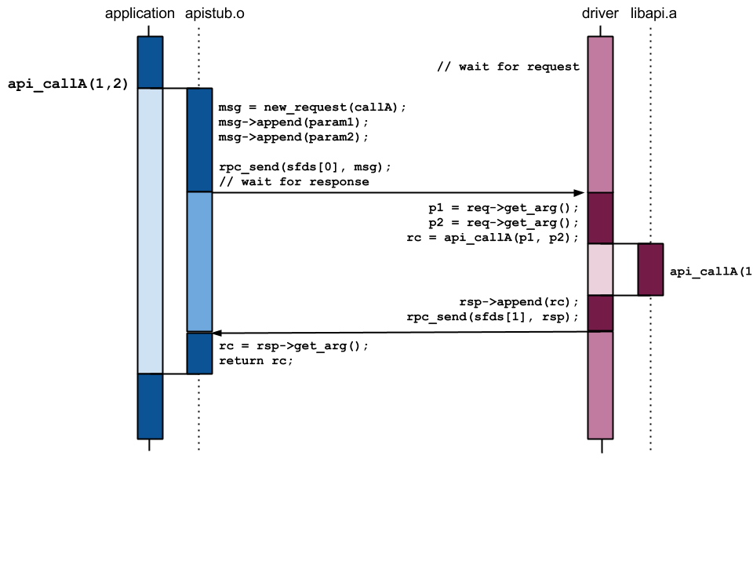

bzip2 API Remoting
==================

This is an experimental repository used to compare and contrast the use of
different RPC mechanisms, by applying them to bzlib API and the bzip2
command-line tool.

Background
----------

One of the best ways to ensure software security is to perform
[privilege separation](https://en.wikipedia.org/wiki/Privilege_separation):
dividing a large application into different chunks depending on the different
privileges that are needed.   Each chunk runs as a distinct process, meaning
that address spaces are not shared between the chunks &ndash; and any successful
exploit for one chunk doesn't automatically get access to the entirety of the
program.

Chrome and OpenSSH are two of the most well-known applications that are
privilege separated:

 - Chrome uses separate renderer processes so that the various kinds of media
   that can appear in a web page (which are processed using a variety of
   third-party media handling libraries) are completely walled off from the rest
   of the system.
 - OpenSSH governs access to systems based on sensitive authentication data;
   this data is specifically held in a distinct, simple, process that is only
   connected to the rest of the application by a tightly constrained IPC
   channel.

Once an application is decomposed into different processes, those processes
need to communicate among themselves.  As a bare minimum, this requires some
kind of inter-process communication (IPC) mechanism.  However, just having a
communication channel (such as a UNIX domain socket) isn't enough; components
need a way of invoking functionality in another component, passing structured
data back and forth along the way.  We'll refer to this as a *remote procedure
call* (RPC) mechanism.

This repository holds experimental exlorations of the various options for RPC
mechanisms.

RPC Framework Desiderata
------------------------

This section describes the different possible features that a potential RPC
framework might have.

### Serialization

The first core feature for an RPC framework is some kind of serialization
mechanism &ndash; a way to convert different kinds of data structures to and from
sequences of bytes, ready for transmission between processes.

A serialization mechanism typically includes a number of base types &ndash;
integers, characters, booleans, floating point values, strings &ndash; that map
onto the base types of the programming language.

On top of the base types, various compound types are normally available:

 - *arrays*: linear collections of values of the same type (e.g. like the C type `int[]`)
 - *structures* or *records*: collections of related data as distinct fields
    (e.g. like C's `struct`).
 - *variants* or *unions*: a range of different possible type/values (e.g. like
    C's `union`, where the choice of which one is present may be implicit or
    explicit).
 - *maps* or *dicts*: a collection of key/value pairs.

### Schema

The serialization mechanism for an RPC framework may or may not require the use
of an explicit **schema**, which describes the valid data structures for a
particular RPC interface.  For example, to transmit the data for a 3-dimensional
point:

 - Code using a schema-less framework would simply encode three floating point
   values one after another, with an implicit convention for their order.
 - Code using a schema would explicitly specify that a `Point3D` type was a
   structure with fields `x`, `y`, and `z`, each of floating type.

Frameworks with schemas are more complex and require more set-up (to specify
the schema), but are more robust &ndash; messages that don't match the expected
schema can be automatically detected and rejected.

### Transport

Once a collection of information has been serialized, it needs to be
transmittted to the other process involved in the RPC exchange.  This requires a
transport mechanism, but the RPC framework may or may not consider this part of
their remit:

 - Some frameworks include mechanisms for managing the transport; this is common
   when the framework also covers communication between different machines.
 - Some frameworks regard the transport as orthogonal to their purpose; once a
   byte stream is generated, it's the sending application's job to get it to the
   receiver.

### RPC Invocation

To be convenient, invoking functionality in a different process needs to be more
than just sending and receiving messages.  Ideally, it should take a similar
form to invoking functionality in the same process, via a function call.  To do
this, the RPC mechanism needs to bundle up all of the input parameters for a
remote function into a **request** message, and when the corresponding
**response** message arrives, it contain all of the output parameters resulting
from the function invocation.  (As the two processes do not normally share an
address space, this approach works best with data that is passed by value).

### Event Model and Threading

Sending and receiving messages between processes requires some sort of event
processing system that handles receipt notifications and (possibly) inter-thread
scheduling.  An RPC framework may include an event processing model, or may
require the application to integrate RPC processing into its own existing event
model in some way.  An RPC framework may also require the use of multiple
threads, or may be written assuming use in a single-threaded manner (and thus
need external synchronization for use in a multi-threaded application).

The event model also affects whether it is possible for invocation of remote
functionality to look identical to invocation of local functionality
(i.e. apparently synchronous).

### File Descriptor Transfer

For sandboxing mechanisms that restrict access to the local environment
(e.g. Capsicum), it is important to know whether the RPC framework allows the
transfer of file descriptors between processes on the same machine; this
allows a remote process to operate on a kernel resource owned by the invoker,
even though the remote process cannot open that resource on its own.

Any such mechanism relies on the `SCM_RIGHTS` feature of an underlying UNIX
domain socket transport.

### Language Support

Some RPC frameworks include support for applications written in different
languages, which in turn would allow for different components of a privilege
separated application to be written in different languages.

Note that C and C++ are a special case here; a C-based framework can always
be used by C++ code, and it's often possible to write a C wrapper layer that
allows a C++-based framework to be used.  However, this does normally still
involve a run-time dependency on the `libstdc++` C++ standard library.

### Dependencies

Simpler RPC frameworks are self-contained, and have no additional
dependencies; others impose a requirement that dependent libraries (e.g. the
`libstdc++` for a C++ framework) are available on the system.  The set of
dependencies needed for an application written in C is of particular interest.

RPC Framework Candidates
------------------------

This section gives an overview of possible candidate RPC frameworks.  It does
not include technologies that are purely serialization mechanisms (e.g.
[ASN.1](https://en.wikipedia.org/wiki/Abstract_Syntax_Notation_One)) without
any RPC aspects.

### Hand-Rolled Code

The least common denominator for performing RPC is not to use any framework, but
to individually code the mechanisms required.

 - Serialization: manual
 - Schema: no
 - Transport: unspecified
 - RPC invocation: unspecified
 - Event model: unspecified
 - FD transfer: manual
 - Language support: manual
 - Dependencies: none

### libnv

FreeBSD 11.x includes the
[libnv](https://www.freebsd.org/cgi/man.cgi?query=nv&apropos=0&sektion=3&manpath=FreeBSD+11-current&format=html)
library created by Pawel Jakub Dawidek, which deals with building and
transferring lists of name-value pairs.

 - Serialization:
     - base types: `bool`, `number`, `string`, `binary`, `descriptor`
     - compound types: name-value dictionaries
 - Schema: no
 - Transport: external socket
 - RPC invocation: no
 - Event model: no
 - FD transfer: **yes**
 - Language support: C
 - Dependencies: `libnv`

### D-Bus

D-Bus is a message bus system intended for use in UNIX desktop systems.  By
default, it assumes that applications will communicate via either a
system-wide or session-wide daemon; however, it is possible to set up a
private point-to-point connection between two processes.

 - Serialization:
     - [base types](https://dbus.freedesktop.org/doc/dbus-specification.html#basic-types):
       `BYTE`, `BOOLEAN`, `[U]INT{16,32,64}`, `DOUBLE`, `UNIX_FD`, `STRING`
     - [compound types](https://dbus.freedesktop.org/doc/dbus-specification.html#container-types):
       `STRUCT`, `ARRAY`, `VARIANT`
 - Schema: no
 - Transport: yes (shared bus or private connection over UNIX domain socket)
 - RPC invocation: yes, per-object methods and signals
 - Event model: no
 - FD transfer: **yes**
 - Language support: C, bindings for many languages
 - Dependencies: `libdbus`

### gRPC

[gRPC](http://www.grpc.io/) was released in 2015 by Google, as a general RPC
framework.  gRPC uses an updated (v3) version of protocol buffers for its
serialization mechanism, but also includes communication libraries for RPC
client and server applications.

Note that although gRPC claims to support C (and its core internals are written
in C), there is no C API for serialization or RPC invocation.

 - Serialization:
     - base types: `bool`, `[su]int{32,64}`, `float`, `double`, `[s]fixed{32,64}`,
       `string`, `bytes`, `enum`
     - compound types: `message`, `optional`, `repeated`
 - Schema: yes
 - Transport: yes (IP, UNIX domain socket)
 - RPC invocation: yes
 - Event model: yes
 - FD transfer: no
 - Language support: C++, Go, Java, Python, Ruby, C#
 - Dependencies: `grpc`, `libssl`, `zlib`, `libstdc++`

### Cap'n Proto

[Cap'n Proto](https://capnproto.org) was created for the
[Sandstorm](https://sandstorm.io/) project by Kenton Varda (who was one of the
creators of V2 of Google's protocol buffers).

 - Serialization:
     - [base types](https://capnproto.org/language.html#built-in-types): `Bool`,
       `[U]Int{8,16,32,64}`, `Float{32,64}`, `Text`, `Data`, `enum`
     - compound types: `List`, `struct`, `union`, `interface`
 - Schema: yes
 - Transport: yes (IP, UNIX domain socket)
 - RPC invocation: yes
 - Event model: [per-thread event loops](https://capnproto.org/cxxrpc.html#event-loop-concurrency)
 - FD transfer: [no](https://groups.google.com/forum/#!topic/capnproto/sKpzanYNZmQ)
 - Language support: C++, Erlang, Go, Javascript, Python, Rust
 - Dependencies: `capnproto`, `libstdc++`

Target Modifications
--------------------

[bzip2](http://www.bzip/org) is the example target used to explore the
differences between different RPC frameworks; this target is chosen because
[Ben Laurie](https://www.links.org) has previously
[manually converted](http://www.links.org/?cat=12) it to be privileged
separated in order to apply the
[Capsicum security framework](https://www.cl.cam.ac.uk/research/security/capsicum/).
It is also of a manageable size, without being too trivial.

To make bzip2 more suitable for having a remote implementation, we first make
a couple of modifications to the library.

### Modification: FILE* to file descriptor

The `bzlib` API includes a number of entrypoints that take a `FILE*` argument;
however, this is not a good type to be used on an inter-process boundary,
because the C library adds buffering and other metadata that cannot be easily
mirrored between processes.

To cope with this, we add `...OpenFd()` entrypoints that are analogous to the
existing `...Open()` entrypoints, but which take a file descriptor argument
instead of a `FILE*` argument.

### Modification: Streaming API Entrypoints

As it stands, the bzip2 codebase includes a `bzlib` API (the
`BZ2_bz...()` functions in `libbz2`) and a main command-line utility `bzip2`
that uses that API to do compression and decompression.  However, the API is
quite low-level, involving reading and writing chunks of data from the
compressed file; it does not include any entrypoints that process an entire
file at once.

The `bzip2` command line utility does include such functions,
`compressStream` and `decompressStream`, which loop around using the `bzlib`
entrypoints; these are the entrypoints that are remoted in the manual
remoting example for Capsicum mentioned above.

Therefore, in order to compare like with like, we add an additional wrapper
layer to the `bzlib` API, with the following entrypoints:

 - `int BZ2_bzCompressStream(int ifd, int ofd, int blockSize100k, int verbosity, int workFactor)`
 - `int BZ2_bzDecompressStream(int ifd, int ofd, int verbosity, int small)`
 - `int BZ2_bzTestStream(int ifd, int verbosity, int small)`

The `bzip2` command-line program is also modified to use these entrypoints
rather than implementing streaming loops in its own `compressStream` /
`decompressStream` / `testStream` functions.

### Modification: Annotate API

The process of generating serialization and deserialization code that maps
between function parameters and message fields is tedious and time-consuming
to do manually.  To allow for the future possibility of a tool to automate
this process, we extend the `bzlib.h` header file with extra annotations.
These annotations give a richer semantics than the base C language allows
(cf. Microsoft's
[Security Annotation Language](https://msdn.microsoft.com/en-us/library/hh916383.aspx)),
for example:

 - `__size(param_name)` indicates that the size of data pointed to by an
   argument is given by a specific other argument.
 - `__handle` indicates that a pointer value is opaque, i.e. the data pointed to is
   never accessed by the caller (incomplete types are also treated as handles).
 - `__isfd` indicates that an `int` argument holds a file descriptor.
 - `__cstring` indicates that a `char*` argument holds a NUL-terminated C string.

These annotations are macros that are conditionally included when
`IDL_GENERATE` is defined, so a normal build of the library is unaffected.

API Remoting Structure
----------------------

All of the API remoting examples in this repository share a similar base
design.

 - The existing `bzip2` application (modified as described above) is built
   to link against a **stub** library `libbz2-<variant>.a` rather than the
   core `libbz2.a` library.  This stub code handles:
     - forking off a separate driver process to provide the API implementation
     - serializing input parameters into request messages
     - de-serializing output values from response messages.
 - The separate **driver** process holds the functionality of the code
   library, with wrapper code to interact with the RPC mechanism:
     - de-serializing input values from request messages
     - serializing output values into response messages.

This sequence diagram assumes that the second process is already available;
that can be accomplished on first use of the API by forking a sub-process that
in turn invokes a new program containing the API driver program:

### File Descriptor Inheritance

Not all of the RPC frameworks used support the passing of file descriptors
over their transports.  For those that do not (gRPC and Cap'n Proto), we
currently use a UNIX socket that runs in parallel to the main RPC socket.
To send a file descriptor:
 - The sender encodes a nonce in the place where a file descriptor argument
   of an RPC message would be.
 - The sender also sends a message on the parallel UNIX socket; the data
   content of the message is the nonce, and the `SCM_RIGHTS` ancillary
   data transfers the file descriptor.
 - The receiver extracts the expected nonce from the normal RPC message.
 - The received reads the parallel message from the UNIX socket and checks
   that its data content matches the nonce.  This `readmsg` operation
   installs the transferred file descriptor in the receivers fdtable.

(Note that this mechanism is currently implemented in a naive fashion,
with no integration of the parallel socket into the program's event loop.)

Disclaimer
----------

This is not an official Google product.
